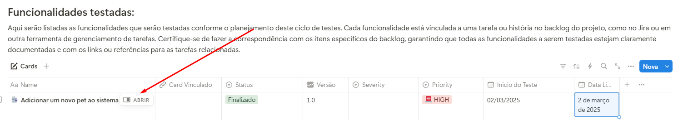

Fala, pessoal! Tudo bem com vocês? Sejam bem-vindos ao **Aprendendo QA**! Hoje quero compartilhar um modelo base de planejamento de testes que criei e organizei no Notion. A ideia é ajudar iniciantes e equipes pequenas ou médias a gerenciarem e executarem seus testes de forma mais eficiente.

Este modelo é totalmente expansível e adaptável, permitindo que você adicione informações conforme a necessidade do projeto. Então, pega um café e vem comigo entender como ele funciona! ☕

Você pode acessar o modelo <a href="https://www.notion.so/Planejamento-de-Teste-1a54009fc24680d79090cc026df55354?pvs=4" target="_blank">aqui</a>.

---

## Estrutura Geral do Modelo 📚

O modelo está dividido em duas partes principais:

1. **Funcionalidades (Hierarquia Pai)**: Representam as funcionalidades do software que serão testadas. Cada funcionalidade pode ser expandida para incluir detalhes adicionais.
2. **Cenários de Teste (Hierarquia Filho)**: São os casos de teste vinculados às funcionalidades. Cada cenário também pode ser detalhado para incluir evidências, passos de execução, payloads, entre outros.
3. **Bug | Impedimento | Sub-bug (Hierarquia Sub-filho)**: São defeitos ou falhas vinculadas a um caso de teste, que impacta de liberação de uma funcionalidade em sua plena liberação

Além disso, o modelo inclui seções importantes como:

- Objetivo do Planejamento
- Ambientes de Teste
- Ferramentas Utilizadas
- Requisitos do Sistema
- Critérios para Início e Término dos Testes

---

## Como Usar o Modelo?

### 1. Funcionalidades

Cada funcionalidade do software deve ser registrada em uma "planilha" ou tabela no Notion (ou outra ferramenta). Essas funcionalidades podem ser expandidas para incluir mais informações relevantes, como requisitos e descrição detalhada.

#### Exemplo de Funcionalidade Criada:

Implementar a funcionalidade de adicionar PET ao sistema

##### Exemplo de Detalhamento da Funcionalidade:

Podemos modificar o modelo para funcionalidade para conforme desejamos, mas inicialmente, foi criado 2 sub-tópico, sendo a descrição e os Requisitos

Com isso criaremos as funcionalidades de acordo com as histórias existentes no sistema, e com base nela e na definição da descrição/ Requisitos iremos criar nossos casos de teste

### 2. Cenários de Teste

Os cenários de teste são vinculados às funcionalidades (Card-Pai) e podem ser detalhados para incluir pré-condições, passos de execução, payloads e resultados esperados/obtidos.

#### Exemplo de Caso de Teste Criado:

Validar Fluxo funcional da funcionalidade Adicionar PET ao sistema

##### Exemplo de Detalhamento do Caso de Teste:

Assim como no Planejamento de Teste, os Casos de testes podem ter modelos próprios, e de acordo com a necessidade do time, No fim do artigo será explicado como criar esses modelos

Para o modelo do exemplo proposto, Foi criado alguns Tópicos, sendo eles:

- _Descrição_ | _Pré-condição_ | _Passos de execução_

- Payload (_Request_ e _Response_)

- _Resultado Esperado_ | _Resultado Obtido_

Inicialmente, criaremos os casos de teste de acordo com as funcionalidades existentes no sistema, e com base nessas funcionalidades e suas definições, iremos definir como será feito o ciclo de teste

---

## Expansibilidade do Modelo ✨

Um dos grandes diferenciais deste modelo é a possibilidade de expansão conforme as necessidades do projeto evoluem:

- **Funcionalidades (Pai)**: Podem incluir mais detalhes como dependências externas, links para documentação ou critérios específicos.
- **Cenários de Teste (Filho)**: Podem ser enriquecidos com evidências como capturas de tela, logs ou vídeos da execução dos testes.

Por exemplo:

- Adicionar métricas aos cenários, como tempo médio de execução.
- Incluir validações específicas nos requisitos das funcionalidades.

Essa flexibilidade permite que o modelo seja utilizado tanto em projetos simples quanto em sistemas mais complexos.

---

## Criando Modelos Pré-feitos para Funcionalidades e Casos de Testes 📝

Este documento base foi criado com o objetivo de melhorar a organização e a usabilidade ao longo do ciclo de testes. Uma das funcionalidades mais interessantes desse modelo é a possibilidade de criar **modelos pré-feitos**. Isso permite que você crie templates de testes personalizados, como, por exemplo, para Teste de API, Teste de Regressão, entre outros, que podem alterar o escopo do que será testado ou validado.

Para criar um novo modelo, basta seguir os passos abaixo:

1. **Criação de Novo Modelo**:

   - 
   - Clique no botão **NOVO** e selecione a opção para criar um novo modelo.

2. **Detalhamento do Modelo**:
   - 
   - Após selecionar a opção, você poderá adicionar **Baias** e **Seções**, o que permitirá um detalhamento mais específico de acordo com a necessidade do projeto.

Com essas etapas, você pode criar modelos personalizados para diferentes tipos de testes e adaptá-los conforme os requisitos do seu projeto, tornando o processo mais ágil e eficiente.

## Benefícios do Modelo 🛠️

1. **Organização**: Centraliza todas as informações relacionadas ao planejamento e execução dos testes.
2. **Padronização**: Garante consistência na documentação dos testes entre diferentes projetos ou equipes.
3. **Escalabilidade**: Pode ser usado por equipes pequenas ou grandes devido à sua estrutura expansível.
4. **Facilidade de Uso**: Ideal para iniciantes que estão aprendendo sobre planejamento de testes.

---

## Conclusão 🎯

Eu criei este modelo pensando em todos nós que, no dia a dia, enfrentamos desafios na organização dos nossos processos de teste. Ele nasceu da minha própria experiência e da vontade de facilitar o trabalho, sem complicar.

Compreendendo as dificuldades para iniciantes, e entendendo a complexidade de assimilação com as ferramentas pagas disponiveis no mercado, acredito que este modelo é uma ferramenta que possa ser essencial para quem quer unir eficiência e qualidade de forma simples, mas com a força necessária para atender às demandas reais dos nossos projetos. Ele foi desenvolvido com carinho para ajudar a transformar a forma como lidamos com os testes.

Se você se identificou com este conteúdo ou ficou com alguma dúvida sobre como implementar esse modelo na prática, me conta nos comentários! E, se achar que outros QAs podem se beneficiar dessa abordagem, compartilhe o artigo.

Um grande abraço e até a próxima! 🚀
